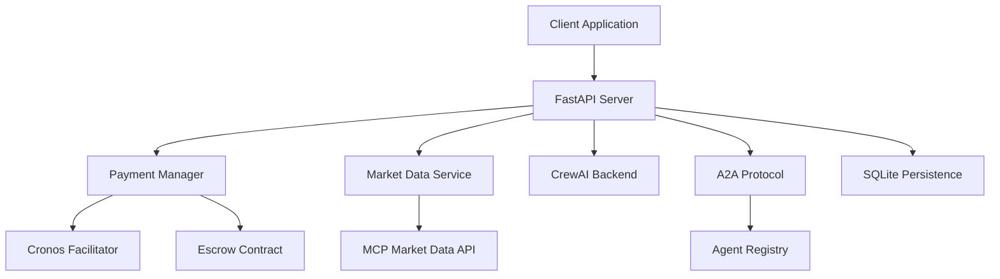

# Design Document

## Overview

The MCP Market Data Agent is a FastAPI-based service that integrates with the 0rca-agent-sdk to provide paid access to cryptocurrency market data through HTTP endpoints and Agent-to-Agent (A2A) communication. The system implements the x402 payment protocol with Cronos facilitator verification, fetches data from the MCP Market Data API, and uses CrewAI to generate natural language responses.

The agent serves as a bridge between clients seeking market data and the MCP Market Data API, adding value through AI-powered analysis and natural language explanations while ensuring payment verification through the 0rca ecosystem.

## Architecture

### High-Level Architecture



### Component Interaction Flow

1. **Request Processing**: Client sends request to `/chat` endpoint
2. **Payment Verification**: System checks for x402 payment proof and verifies through Cronos facilitator
3. **Data Retrieval**: Upon successful payment, system fetches market data from MCP API
4. **AI Processing**: CrewAI backend processes raw market data into natural language response
5. **Response Delivery**: Formatted response returned to client with appropriate HTTP status

## Components and Interfaces

### FastAPI Server (`app.py`)
- **Purpose**: Main HTTP server handling client requests and routing
- **Key Endpoints**:
  - `GET /health`: Health check endpoint
  - `POST /chat`: Main market data query endpoint (x402 protected)
  - `POST /a2a/send`: Send A2A messages to other agents
  - `POST /a2a/receive`: Receive A2A messages from other agents
- **Dependencies**: PaymentManager, MarketDataService, CrewAIBackend, A2AHandlers

### Payment Manager Integration
- **Purpose**: Handles x402 payment flow and verification
- **Key Methods**:
  - `verify_payment()`: Validates payment proof through facilitator
  - `build_payment_requirements()`: Generates x402 payment requirements
  - `check_escrow_balance()`: Reads escrow contract balance (read-only)
- **Integration**: Uses existing `orca_agent_sdk.core.payment.PaymentManager`

### Market Data Service (`market_data.py`)
- **Purpose**: Wrapper for MCP Market Data API interactions
- **Key Methods**:
  - `fetch_market_data()`: Retrieves current market data
  - `parse_response()`: Validates and parses API responses
  - `handle_api_errors()`: Manages API failures and timeouts
- **API Endpoint**: `https://mcp.crypto.com/market-data/mcp`

### CrewAI Backend Adapter (`crewai_backend.py`)
- **Purpose**: Integrates CrewAI for natural language processing of market data
- **Key Methods**:
  - `process_market_data()`: Converts raw data to natural language
  - `generate_summary()`: Creates comprehensive market analysis
  - `handle_processing_errors()`: Manages AI processing failures
- **Integration**: Extends existing `orca_agent_sdk.backends.crewai_backend.CrewAIBackend`

### A2A Handlers (`a2a_handlers.py`)
- **Purpose**: Manages Agent-to-Agent communication
- **Key Methods**:
  - `send_message()`: Sends messages to other agents
  - `receive_message()`: Processes incoming A2A messages
  - `validate_message_schema()`: Ensures message format compliance
- **Integration**: Uses existing `orca_agent_sdk.core.a2a.A2AProtocol`

### Configuration Management (`config.py`)
- **Purpose**: Centralizes configuration for all components
- **Key Settings**:
  - MCP API endpoint and credentials
  - Payment amounts and token addresses
  - CrewAI configuration parameters
  - A2A agent registry settings

## Data Models

### Payment Request Model
```python
@dataclass
class PaymentRequest:
    scheme: str = "exact"
    network: str  # CAIP chain identifier
    token: str    # Token contract address
    resource: str # Resource being accessed
    maxAmountRequired: str  # Payment amount
    beneficiary: str  # Escrow contract address
```

### Market Data Response Model
```python
@dataclass
class MarketDataResponse:
    symbol: str
    price: float
    timestamp: int
    market_depth: Dict[str, Any]
    volume_24h: float
    price_change_24h: float
```

### A2A Message Model
```python
@dataclass
class A2AMessage:
    header: Dict[str, Any]  # message_id, from, to, timestamp
    task: Dict[str, Any]    # action, payload
```

### Chat Response Model
```python
@dataclass
class ChatResponse:
    result: str
    market_data: Optional[MarketDataResponse]
    timestamp: int
    processing_time_ms: int
```

## Correctness Properties

*A property is a characteristic or behavior that should hold true across all valid executions of a system-essentially, a formal statement about what the system should do. Properties serve as the bridge between human-readable specifications and machine-verifiable correctness guarantees.*

### Property Reflection

After reviewing all testable properties from the prework analysis, several redundancies were identified and consolidated:

- Properties 1.1 and 1.4 both test HTTP 402 responses and can be combined into a comprehensive payment validation property
- Properties 2.1, 2.2, and 2.3 all test API interaction and can be combined into a single API processing property
- Properties 4.1, 4.2, 4.4, and 4.5 all test A2A message handling and can be combined into comprehensive A2A properties
- Properties 6.1, 6.2, 6.3, and 6.4 all test logging and can be combined into a single logging property

### Core Properties

**Property 1: Payment verification determines access**
*For any* HTTP request to `/chat`, the system should return HTTP 402 with payment requirements when no valid payment proof is provided, and should process the request when valid payment proof is verified through the Cronos facilitator
**Validates: Requirements 1.1, 1.2, 1.3, 1.4**

**Property 2: API retry behavior**
*For any* MCP API request that times out, the system should retry exactly once before returning an error response
**Validates: Requirements 2.5**

**Property 3: Market data processing completeness**
*For any* successful API response from MCP Market Data API, the system should extract and validate price, market depth, and timestamp information before processing
**Validates: Requirements 2.1, 2.2, 2.3**

**Property 4: CrewAI response generation**
*For any* valid market data input, the CrewAI backend should generate a natural language response that includes relevant market metrics and organizes multi-asset information clearly by asset
**Validates: Requirements 3.1, 3.2, 3.3**

**Property 5: A2A message validation and processing**
*For any* A2A message sent to `/a2a/send` or `/a2a/receive`, the system should validate the JSON schema before processing and return appropriate HTTP status codes (200 for success, 400 for validation errors)
**Validates: Requirements 4.1, 4.2, 4.3, 4.4, 4.5**

**Property 6: SDK integration consistency**
*For any* payment verification or data persistence operation, the system should use the corresponding 0rca-agent-sdk methods rather than custom implementations
**Validates: Requirements 5.2, 5.3**

**Property 7: Comprehensive error logging**
*For any* system error (payment failures, API failures, A2A failures), the system should log the error with appropriate severity level and relevant context details
**Validates: Requirements 6.1, 6.2, 6.3, 6.4**

## Error Handling

### Payment Errors
- **Invalid Payment Proof**: Return HTTP 402 with detailed error message
- **Facilitator Verification Failure**: Return HTTP 402 with facilitator error details
- **Escrow Balance Insufficient**: Return HTTP 402 with balance information

### API Errors
- **MCP API Timeout**: Retry once, then return HTTP 503
- **MCP API Invalid Response**: Return HTTP 502 with parsing error details
- **MCP API Unavailable**: Return HTTP 503 with service unavailable message

### AI Processing Errors
- **CrewAI Processing Failure**: Return raw market data with error notice
- **CrewAI Timeout**: Return partial results with timeout warning
- **CrewAI Configuration Error**: Return HTTP 500 with configuration error

### A2A Communication Errors
- **Invalid Message Schema**: Return HTTP 400 with validation details
- **Target Agent Not Found**: Return HTTP 404 with agent registry information
- **Network Communication Failure**: Return HTTP 503 with network error details

### System Errors
- **Database Connection Failure**: Log error and continue with in-memory operations
- **Configuration Loading Error**: Fail fast with detailed configuration error message
- **SDK Initialization Failure**: Fail fast with SDK error details

## Testing Strategy

### Dual Testing Approach

The system will implement both unit testing and property-based testing to ensure comprehensive coverage:

- **Unit tests** verify specific examples, edge cases, and error conditions
- **Property tests** verify universal properties that should hold across all inputs
- Together they provide comprehensive coverage: unit tests catch concrete bugs, property tests verify general correctness

### Property-Based Testing Requirements

- **Testing Library**: Use `hypothesis` for Python property-based testing
- **Test Iterations**: Configure each property-based test to run a minimum of 100 iterations
- **Property Tagging**: Each property-based test must include a comment with the format: `**Feature: mcp-market-data-agent, Property {number}: {property_text}**`
- **Property Implementation**: Each correctness property must be implemented by a single property-based test

### Unit Testing Requirements

Unit tests will focus on:
- Specific examples of payment verification flows
- Edge cases for API response parsing
- Integration points between FastAPI and SDK components
- Error handling scenarios with known inputs

### Test Coverage Areas

1. **Payment Flow Testing**
   - Valid and invalid payment proof scenarios
   - Facilitator verification success and failure cases
   - Escrow balance reading functionality

2. **API Integration Testing**
   - MCP API response parsing with various data formats
   - Timeout and retry behavior verification
   - Error response handling

3. **AI Processing Testing**
   - CrewAI backend integration with market data
   - Natural language response generation quality
   - Multi-asset data organization

4. **A2A Communication Testing**
   - Message schema validation
   - Agent registry integration
   - Inter-agent communication flows

5. **Error Handling Testing**
   - Comprehensive error logging verification
   - Appropriate HTTP status code responses
   - Graceful degradation scenarios