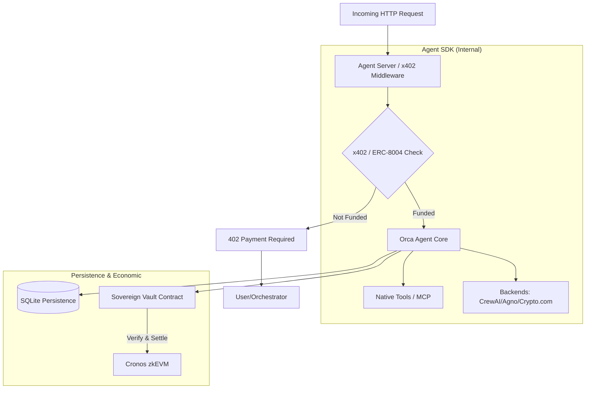

# 0rca Network SDK

[](https://pypi.org/project/orca-network-sdk/)
[](https://opensource.org/licenses/MIT)

**0rca Network SDK** (`orca-network-sdk`) is a production-ready framework for building **Sovereign, Monetizable, and Orchestrated AI Agents**. It transforms standard AI agents (CrewAI, LangChain, Agno) into independent economic actors on the blockchain.

Every agent built with this SDK is paired with a **Sovereign Vault** (`OrcaAgentVault.sol`)—a dedicated smart contract that holds the agent's earnings and manages task escrows.

## 🏗 Architecture Overview



## 🚀 Key Features

- **Sovereign Vault Architecture**: Each agent has its own on-chain Vault to receive payments and tasks.
- **Autonomous Monetization (x402)**: Built-in support for "Payment Required" flows.
- **TaskEscrow Integration**: Agents can accept "Funded Tasks" (USDC locked in Vault) and automatically `spend` (claim) funds upon completion.
- **Sovereign Identity**: Agents sign transactions with their own EVM identity key.
- **Multi-Backend support**: Pluggable architecture for your favorite AI frameworks:
  - [CrewAI](https://crewai.com)
  - [Agno](https://agno.com)
  - [Crypto.com AI Agent SDK](https://github.com/crypto-com/ai-agent-sdk)

## 📦 Installation

```bash
pip install orca-network-sdk
```

## 🛠 Quick Start

### 1. Create your Agent

```python
from orca_agent_sdk import OrcaAgent

# Initialize the Sovereign Agent
agent = OrcaAgent(
    name="MySovereignAgent",
    model="gpt-4",
    system_prompt="You are a helpful assistant.",
    
    # Financial Configuration
    price="0.1",       # 0.1 USDC per task
    wallet_address="0xYourWallet...", # Where you withdraw earnings to
    
    # Identity
    identity_wallet_path="agent_identity.json",
    
    # Vault (Optional - can be loaded from env AGENT_VAULT)
    vault_address="0xYourVaultAddress..." 
)

# Start the Agent Server
if __name__ == "__main__":
    agent.run(port=8000)
```

### 2. Fund a Task (Client Side)

Users (Orchestrators) interact with the agent by funding a task on its Vault.

```python
# 1. User approves USDC to the Agent's Vault
# 2. User calls `createTask(taskId, amount)` on the Vault
# 3. User sends HTTP request to Agent with `X-TASK-ID`
```

### 3. Agent Execution (Server Side)

When the agent receives the request:
1. It validates the tasks existence on-chain (or via x402 signatures).
2. It executes the AI logic (CrewAI/Agno/etc).
3. It calls `spend(taskId, amount)` on its Vault to claim the funds.

## 📜 Sovereign Agent Vault (`OrcaAgentVault.sol`)

The `OrcaAgentVault` is the financial heart of the agent.

- **`createTask(bytes32 taskId, uint256 amount)`**:
  Anyone can call this to lock USDC into the vault for a specific task.
  
- **`spend(bytes32 taskId, uint256 amount)`**:
  Only the **Agent** (via its private key) can call this to mark a task as complete and "claim" the funds into its internal balance.
  
- **`withdraw(address recipient, uint256 amount)`**:
  Only the **Owner** (Developer) can withdraw the claimed funds.

## 🧪 Development & Testing

Run the included test suite:

```bash
python -m unittest discover tests
```

## 📄 License

MIT License. See [LICENSE](LICENSE) for details.

---
Built with 💙 by [0rca Network](https://0rca.network)
